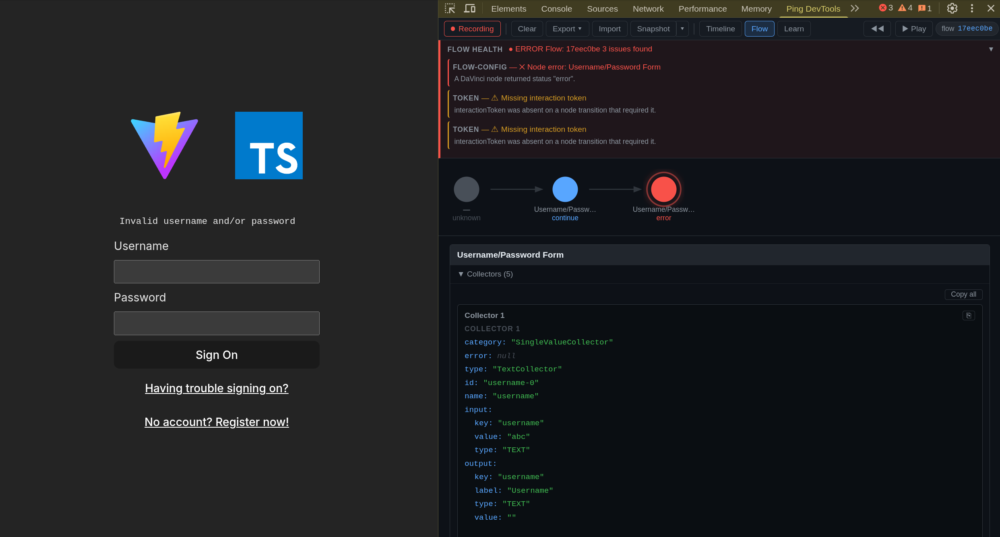
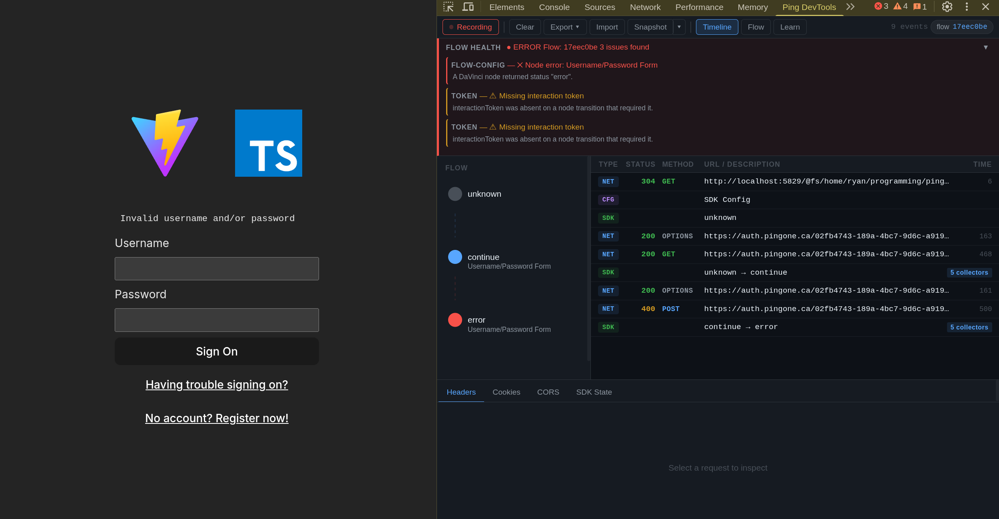
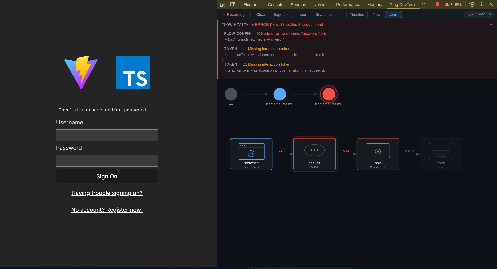

# Ping DevTools

**Captures, correlates, and diagnoses** OIDC/OAuth 2.0 authentication flows in real time — works standalone with any OIDC provider or as an enhanced companion to the Ping Identity SDK.

Most auth debugging starts in the Network panel and stays there — copying tokens into jwt.io, cross-referencing timestamps, guessing which 400 was the CORS preflight and which was a bad grant. Ping DevTools replaces that with a single panel that captures network traffic, annotates it with OIDC semantics, optionally merges in SDK-level events, and runs an automated diagnosis engine that tells you _what went wrong and how to fix it_.



---

## Status

**v0.1.0 — alpha, active development.** The extension is functional and loadable as an unpacked Chrome extension. It is not published to the Chrome Web Store. The package is private (`@forgerock/devtools-extension`).

---

## Network-first OIDC intelligence

The extension automatically detects and annotates OIDC/OAuth 2.0 traffic without any SDK or bridge integration. This means it works out of the box with **any OIDC provider** — Ping Identity, Auth0, Okta, Keycloak, or any spec-compliant authorization server.

**Well-known discovery** — when the extension sees a request to `/.well-known/openid-configuration` or `/.well-known/oauth-authorization-server`, it parses the response and stores the discovered endpoints (`authorization_endpoint`, `token_endpoint`, `userinfo_endpoint`, etc.). Subsequent requests are matched against these discovered endpoints first, falling back to regex patterns.

**OIDC semantic annotation** — network events that match OIDC endpoints are annotated with structured metadata:

| Phase             | Extracted data                                                   |
| ----------------- | ---------------------------------------------------------------- |
| **discovery**     | Issuer, all discovered endpoints                                 |
| **authorize**     | `client_id`, `state`, `nonce`, `code_challenge`, `response_type` |
| **par**           | `request_uri`, `expires_in`, pushed parameters                   |
| **token**         | `grant_type`, `code_verifier`, tokens received, `token_type`     |
| **userinfo**      | User profile data                                                |
| **revocation**    | Token revocation status                                          |
| **introspection** | Token validity                                                   |
| **end-session**   | Logout status                                                    |

**DPoP detection (RFC 9449)** — detects `DPoP` proof JWTs in request headers, `token_type: "DPoP"` in responses, `use_dpop_nonce` errors, and `DPoP-Nonce` response headers.

**PAR detection (RFC 9126)** — detects Pushed Authorization Requests, correlates `request_uri` values between PAR responses and subsequent authorize redirects.

---

## Diagnosis

Every captured event is run through a rule engine that produces flow-level and per-event diagnostics with severity ratings and numbered remediation steps.

**Flow Health** — a banner at the top surfaces the worst-severity issue across the entire flow. It stays hidden when everything is healthy, expands automatically when a new error arrives during recording, and each issue is clickable — jumping directly to the related event in the Timeline.

**Per-event annotations** — the Inspector's Diagnosis tab appears only when the selected event has issues. Errors get a solid dot on the tab label; warnings get a half dot. Each annotation includes a title, description, relevant data pairs, and step-by-step remediation.

The engine covers:

| Category        | Examples                                                                                       |
| --------------- | ---------------------------------------------------------------------------------------------- |
| **CORS**        | Status-zero failures, missing `Access-Control-Allow-Origin`, wildcard + credentials conflict   |
| **Token**       | Missing `interactionToken` on non-initial nodes, expired JWTs in request headers               |
| **Flow config** | Node error/failure status, connector errors, policy-not-found                                  |
| **OIDC**        | State mismatch, missing PKCE, redirect URI mismatch                                            |
| **OIDC flow**   | Auth code without PKCE, missing `code_verifier`, implicit flow, missing nonce, auth code reuse |
| **DPoP**        | Missing proof, invalid proof structure, method/URI mismatch, nonce required                    |
| **PAR**         | Missing `request_uri` in response, inline params alongside `request_uri`                       |

---

## JWT decoding

Any JWT-like string in the JSON tree viewer (response bodies, headers, SDK state) is automatically detected and rendered as an expandable **JWT** dropdown. Clicking it reveals:

- **Header** — algorithm, type, key ID
- **Claims** — all payload claims with timestamp formatting for `exp`, `iat`, `nbf`
- **Signature** — preview (not verified)

JWT decoding is implemented entirely in Elm with a pure base64url decoder — no external dependencies or JavaScript interop.

---

## Import and export

Flows can be exported for sharing or offline analysis, and imported from JSON.

**Export** — the toolbar dropdown offers two formats:

- **JSON** — full flow state including all events, OIDC annotations, a summary (node count, error count, CORS flags, duration), and metadata. Sensitive data (tokens, passwords, cookies) is automatically redacted.
- **Markdown** — a human-readable report with a flow summary and event timeline grouped by type.

**Import** — paste exported JSON into the import modal. The imported flow replaces live recording (recording pauses automatically). A metadata banner shows the flow ID, capture timestamp, and redaction status. Click **Clear** to discard the import and resume live capture.

---

## Snapshots

Click **Snapshot** to save the current flow state to local storage (up to 5 snapshots, oldest dropped when full). The dropdown arrow next to the button opens a list of saved snapshots showing flow ID, timestamp, and event count. Click an entry to load it (same as importing — recording pauses, import banner appears). Click the delete button to remove a snapshot.

---

## Time-travel playback

The Flow view includes transport controls (**Prev / Play / Pause / Reset**) that step through SDK nodes in sequence. During playback the interval between steps mirrors the real elapsed time, clamped to 300 ms - 1500 ms, so you can watch the flow unfold at roughly the pace it happened.

---

## Why not just use the Network panel?

The Network panel shows HTTP requests. Auth flows are not HTTP requests — they are multi-step state machines that span dozens of requests, involve two independent event streams (network and SDK), and fail in ways that only make sense when you see the full sequence.

Ping DevTools gives you:

- **OIDC-aware annotation** — network requests are automatically classified by OAuth phase (authorize, token, userinfo) with extracted parameters (client_id, grant_type, PKCE, DPoP).
- **Two-stream correlation** — network responses and SDK state transitions are merged into a single timeline, linked by flow ID and causal references.
- **Automated diagnosis** — CORS misconfigurations, expired JWTs, missing PKCE, DPoP proof errors, and connector errors are detected and explained with remediation steps, not left as a 400 status code.
- **Flow-level structure** — the Flow view shows the authentication flow as a sequence of nodes with detail cards, not a flat list of URLs.
- **Inline JWT decoding** — tokens are decoded and displayed with claim formatting directly in the panel.
- **Playback** — step through the flow to see exactly what the SDK saw at each point.



---

## Architecture

TypeScript with Effect-TS on the data plane, Elm on the view, Schema-validated at the boundary. Elm was chosen for its compile-time guarantees — the panel has no runtime exceptions.

```
Host page
  ├── attachDevToolsBridge(davinciClient)   ─┐
  ├── attachJourneyBridge(journeyClient)    ─┤─ CustomEvent('pingDevtools')
  └── attachOidcBridge(oidcClient)          ─┘
            │
      content-script.ts  (MAIN world — postMessage only, no chrome.runtime)
            │
      relay.ts           (isolated world — chrome.runtime.sendMessage)
            │
      service-worker.ts  (Effect ManagedRuntime)
        ├── AuthEventSchema validation (Effect Schema — untrusted input decoded or dropped)
        ├── EventStore (Effect Ref + chrome.storage.local)
        ├── OIDC annotation pipeline:
        │     ├── oidc-discovery.ts     (well-known config parsing)
        │     ├── oidc-annotator.ts     (phase detection + semantic extraction)
        │     ├── dpop-detector.ts      (DPoP proof detection)
        │     └── par-detector.ts       (PAR flow detection)
        ├── diagnosis-engine.ts (flow rules + event rules)
        └── broadcast to panel(s)
            │
      panel/Main.elm  (Elm 0.19)
        ├── Timeline view  — chronological event table with Inspector
        ├── Flow view      — node rail + detail card + health banner
        └── Learn view     — flow-aware lifecycle visualization
```

Network events follow a parallel path: `devtools.ts` uses `chrome.devtools.network.onRequestFinished` with `entry.getContent()` to capture HAR entries including response bodies, filters them against auth URL patterns (with static asset exclusion), and sends them to the service worker. The OIDC annotation pipeline then enriches each event with semantic metadata before it reaches the panel.

---

## Captured event types

| Type                | Source  | Description                                          |
| ------------------- | ------- | ---------------------------------------------------- |
| `network:request`   | network | Outgoing HTTP request to an auth endpoint            |
| `network:response`  | network | Response received (with OIDC semantic annotations)   |
| `network:cors-flag` | network | CORS failure detected (status 0, missing headers)    |
| `sdk:node-change`   | sdk     | DaVinci node transition (start, continue, ...)       |
| `sdk:config`        | sdk     | SDK configuration snapshot (emitted once per bridge) |
| `sdk:journey-step`  | sdk     | AM Journey step fulfilled or rejected                |
| `sdk:oidc-state`    | sdk     | OIDC endpoint settled (authorize, exchange, ...)     |
| `dom:form-submit`   | dom     | Form submission captured                             |
| `dom:redirect`      | dom     | Page redirect detected                               |
| `session:cookie`    | session | Cookie value changed                                 |
| `session:storage`   | session | `localStorage` value changed                         |

Events are linked by `flowId` and an optional `causedBy` reference pointing to the originating event, enabling two-stream correlation in the Timeline.

---

## Security and privacy

The extension requests only `storage` and `clipboardWrite`/`clipboardRead` (for copying collectors and exported data) — no `cookies`, `webRequest`, `tabs`, or other sensitive APIs. Content scripts use a two-world architecture: `content-script.ts` runs in the MAIN world (page access, no `chrome.runtime`), while `relay.ts` runs in the isolated world (runtime access, guarded by a sentinel flag and same-source check), preventing arbitrary page code from injecting messages into the service worker. All SDK events are decoded through `AuthEventSchema` (Effect Schema) before reaching the EventStore — malformed payloads are dropped with a console warning. Captured data is stored in `chrome.storage.local` under a namespaced key and never transmitted off-device. No remote code is loaded or executed.

---

## Build

```bash
nx run devtools-extension:build
```

Output is written to `packages/devtools-extension/dist/`.

> **Prerequisite:** [Elm](https://guide.elm-lang.org/install/elm.html) must be installed and on your `PATH`. The build step compiles `src/panel/Main.elm` into a single JS bundle.

---

## Load in Chrome

1. Open `chrome://extensions`
2. Enable **Developer mode** (top-right toggle)
3. Click **Load unpacked**
4. Select `packages/devtools-extension/dist/`
5. Open DevTools on any page with OIDC traffic -- the **Ping DevTools** tab appears

After rebuilding, click the refresh icon on the extension card at `chrome://extensions`, then close and reopen DevTools.

---

## Wiring up your app

The extension captures and annotates all OIDC network traffic automatically — **no SDK integration is required**. To also see SDK-level events (node transitions, journey steps, OIDC phases, session diffs), add the bridge adapter to your app.

```bash
pnpm add @forgerock/devtools-bridge
```

All `attach*` functions are safe to call unconditionally — they are no-ops when the extension is not installed and when running in SSR/Node.

### DaVinci

```ts
import { davinci } from '@forgerock/davinci-client';
import { attachDevToolsBridge } from '@forgerock/devtools-bridge';

const client = await davinci({ config });
attachDevToolsBridge(client, config);
```

### AM Journey

```ts
import { attachJourneyBridge } from '@forgerock/devtools-bridge';

attachJourneyBridge(journeyClient, config);
```

### OIDC / OAuth

```ts
import { attachOidcBridge } from '@forgerock/devtools-bridge';

attachOidcBridge(oidcClient, { clientId: 'my-spa-client', ...config });
```

---

## Panel views

### Timeline

A chronological table of all captured events. Each row shows event type, status, method, and URL with colour-coded error/CORS flags. Network events with OIDC annotations show a phase badge (e.g. `authorize`, `token`, `par`). A **graph sidebar** draws a vertical SVG rail of SDK node-change events with status-coloured circles and connector lines — click a node in the rail to jump to it in the table. Click any row to open its Inspector panel.

**Inspector tabs** — the right-hand panel shows contextual tabs depending on the selected event:

| Tab            | Shows                                                                                  | Appears for            |
| -------------- | -------------------------------------------------------------------------------------- | ---------------------- |
| **Headers**    | Request and response headers, request/response bodies with JWT decoding                | Network events         |
| **SDK State**  | Full node data — status transitions, tokens, errors, collectors, authorization         | SDK events             |
| **Collectors** | Interactive collector list with copy-all button                                        | SDK node-change events |
| **Cookies**    | Cookie values extracted from request/response headers                                  | Network events         |
| **Session**    | Before/after values for localStorage changes                                           | Session storage events |
| **Config**     | SDK configuration JSON                                                                 | Config events          |
| **CORS**       | Failure reason, preflight status, `Allow-Origin` / `Allow-Credentials` values          | CORS-flagged events    |
| **OIDC**       | Phase, grant type, PKCE status, DPoP proof, tokens received, state/nonce, OAuth errors | OIDC-annotated events  |
| **Diagnosis**  | Severity, title, description, relevant data pairs, remediation steps                   | Events with issues     |

### Flow

A visual representation of the authentication flow as a sequence of SDK nodes. The node rail draws coloured circles for each node with arrows connecting them, status and node-name labels, and a glow effect on the selected node. Selecting a node opens a detail card with contextual information — collectors for DaVinci, callbacks for Journey steps, phase and error data for OIDC — plus any causally linked network requests with expandable request/response bodies. The Flow Health banner appears above the rail when the diagnosis engine detects issues.

### Learn

A canvas-based visualization that maps the request lifecycle. The layout adapts automatically based on what events are present:

| Layout          | When                                | Card sequence                                   |
| --------------- | ----------------------------------- | ----------------------------------------------- |
| **DaVinci**     | DaVinci node-change events detected | Browser -> Server -> SDK -> Form                |
| **Journey**     | AM Journey step events detected     | Client -> AM Server -> Callbacks -> Result      |
| **OIDC Code**   | OIDC network events (no SDK)        | Client -> Auth Server -> Token -> Result        |
| **OIDC + DPoP** | DPoP proof detected                 | Client -> Auth Server -> Token+DPoP -> Result   |
| **OIDC + PAR**  | PAR request detected                | Client -> PAR -> Auth Server -> Token -> Result |

Each card shows a labelled icon with animated connector arrows. Clicking a card expands an accordion detail panel with contextual data — request parameters for the client card, response status and callbacks for the server card, token summary for the result card. Error states are highlighted with red borders and a pulse animation on the error source. Cards are draggable and the canvas supports pan and zoom.

When both SDK bridge events and network OIDC annotations are present, the Learn tab gathers data from both sources — the rail shows SDK events while the card details are populated from network-level OIDC semantics (which carry the rich token and PKCE data).



---

## Packages

| Package                         | Description                                                       |
| ------------------------------- | ----------------------------------------------------------------- |
| `@forgerock/devtools-extension` | The Chrome extension (this package — private, not published)      |
| `@forgerock/devtools-bridge`    | Opt-in SDK adapter — emits `AuthEvent`s from subscribable clients |
| `@forgerock/devtools-types`     | Shared `AuthEvent` Effect Schema definitions and TypeScript types |
